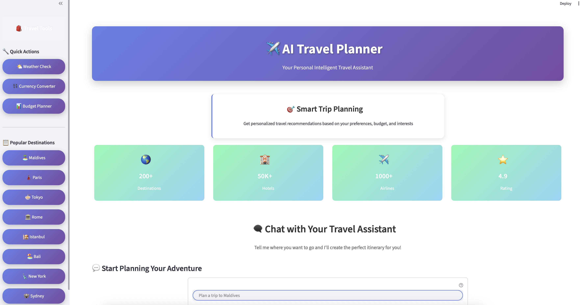
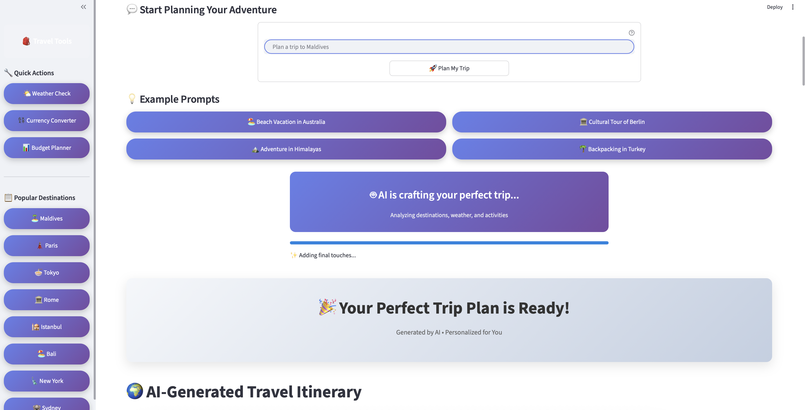
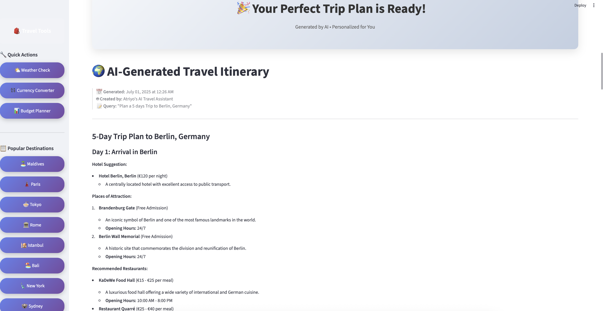
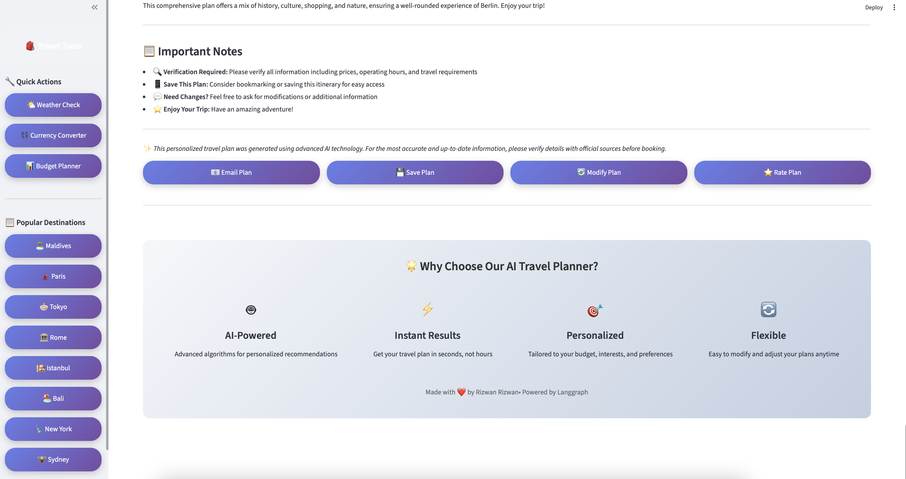

# 🌍 AI Trip Planner - LangGraph Edition

<div align="center">


**Your Personal AI-Powered Travel Assistant**

*Plan amazing trips with the power of AI and LangGraph workflows*

[🚀 Live Demo](#demo) • [📸 Screenshots](#screenshots) • [🔧 Installation](#installation) • [💡 Features](#features)

</div>

---

## ✨ Overview

AI Trip Planner is an intelligent travel planning application that leverages the power of **LangGraph** and **Groq LLM** to create personalized travel itineraries. Built with a modern tech stack including Streamlit for the frontend and FastAPI for the backend, this application provides users with comprehensive travel plans tailored to their preferences, budget, and interests.

### 🎯 What Makes This Special?

- **🤖 AI-Powered Planning**: Uses Groq's open-source LLM for intelligent trip recommendations
- **🔄 LangGraph Workflows**: Implements sophisticated agentic workflows for complex travel planning
- **🎨 Beautiful UI**: Modern, responsive interface with gradient designs and animations
- **🆓 Free APIs**: Built using free and open-source APIs for accessibility
- **⚡ Real-time Processing**: Fast response times with animated progress indicators
- **🌐 Multi-tool Integration**: Weather, currency, budget planning, and place search tools

---

## 🖼️ Screenshots

<div align="center">

### 🏠 Main Interface & Features


*Beautiful gradient design with interactive features and modern UI*

---

### 🗨️ Chat Interface & Input


*Smart chat interface with example prompts and quick actions*

---

### � Trip Planning & Tools  


*Comprehensive tools including weather, currency, and budget planning*

---

### 📋 Trip Results & Itinerary


*Detailed AI-generated travel itineraries with professional formatting*

</div>

> 💡 **View Full Screenshots**: All screenshots are available in high resolution in the [`/screenshots`](./screenshots) folder

---

## 🌟 Features

### 🎨 **Modern User Interface**
- Beautiful gradient-based design
- Responsive layout that works on all devices
- Animated progress bars and visual feedback
- Interactive example prompts and quick actions

### 🤖 **AI-Powered Intelligence**
- **LangGraph Workflows**: Sophisticated multi-step planning process
- **Groq LLM Integration**: Fast and intelligent response generation
- **Contextual Understanding**: Processes complex travel requirements
- **Personalized Recommendations**: Tailored to user preferences and budget

### 🛠️ **Comprehensive Tools**
- **🌤️ Weather Integration**: Real-time weather information
- **💱 Currency Converter**: Multi-currency support
- **📊 Budget Planner**: Cost estimation and budget management
- **🔍 Place Search**: Detailed destination information
- **🧮 Expense Calculator**: Trip cost calculations

### 📱 **User Experience**
- **Quick Actions**: Predefined destination buttons
- **Example Prompts**: Ready-to-use travel planning templates
- **Progress Tracking**: Visual feedback during AI processing
- **Result Management**: Save, email, and modify trip plans

---

## 🏗️ Architecture

### Backend (FastAPI)
```
┌─────────────────┐    ┌──────────────────┐    ┌─────────────────┐
│   Streamlit     │ ──▶│    FastAPI       │ ──▶│   LangGraph     │
│   Frontend      │    │    Backend       │    │   Workflow      │
└─────────────────┘    └──────────────────┘    └─────────────────┘
                                │                        │
                                ▼                        ▼
                       ┌──────────────────┐    ┌─────────────────┐
                       │   Free APIs      │    │   Groq LLM      │
                       │   (Weather, etc) │    │   (Open Source) │
                       └──────────────────┘    └─────────────────┘
```

### Tech Stack
- **Frontend**: Streamlit with custom CSS
- **Backend**: FastAPI with CORS middleware
- **AI Framework**: LangGraph for workflow management
- **LLM**: Groq (open-source)
- **APIs**: Google Places, Weather APIs, Currency APIs
- **Deployment**: Python 3.13+ environment

---

## 🚀 Installation

### Prerequisites
- Python 3.13 or higher
- pip or uv package manager
- API keys for external services (optional for basic functionality)

### Quick Start

1. **Clone the Repository**
   ```bash
   git clone https://github.com/Rizwankaka/AI_Trip_Planner-Langgraph.git
   cd AI_Trip_Planner-Langgraph
   ```

2. **Install Dependencies**
   ```bash
   # Using pip
   pip install -r requirements.txt
   
   # Or using uv (recommended)
   uv pip install -r requirements.txt
   ```

3. **Environment Setup**
   ```bash
   # Create .env file
   cp .env.example .env
   
   # Add your API keys (optional)
   echo "GROQ_API_KEY=your_groq_api_key" >> .env
   echo "GOOGLE_PLACES_API_KEY=your_google_api_key" >> .env
   ```

4. **Start the Backend**
   ```bash
   uvicorn main:app --reload --port 8000
   ```

5. **Launch the Frontend**
   ```bash
   # In a new terminal
   streamlit run streamlit_app.py
   ```

6. **Access the Application**
   - Frontend: http://localhost:8501
   - Backend API: http://localhost:8000
   - API Documentation: http://localhost:8000/docs

---

## 🔧 Configuration

### Environment Variables
Create a `.env` file in the root directory:

```env
# Required
GROQ_API_KEY=your_groq_api_key_here

# Optional (for enhanced features)
GOOGLE_PLACES_API_KEY=your_google_places_api_key
OPENWEATHER_API_KEY=your_weather_api_key
CURRENCY_API_KEY=your_currency_api_key
```

### API Keys Setup

1. **Groq API Key** (Required)
   - Visit [Groq Console](https://console.groq.com/)
   - Create a free account
   - Generate an API key

2. **Google Places API** (Optional)
   - Go to [Google Cloud Console](https://console.cloud.google.com/)
   - Enable Places API
   - Create credentials

3. **Weather API** (Optional)
   - Sign up at [OpenWeatherMap](https://openweathermap.org/api)
   - Get a free API key

---

## 📚 Usage

### Basic Trip Planning
1. Open the application in your browser
2. Enter your travel requirements in the chat input
3. Click "🚀 Plan My Trip" or use example prompts
4. Wait for AI to generate your personalized itinerary
5. Review, save, or modify your trip plan

### Example Prompts
- "Plan a 7-day romantic trip to Paris with a budget of $3000"
- "Create a 10-day adventure tour in the Himalayas"
- "Suggest a family-friendly beach vacation in Goa for 5 days"

### Advanced Features
- Use sidebar tools for quick weather checks
- Convert currencies for budget planning
- Save and email your trip plans
- Modify existing itineraries

---

## 🛠️ Development

### Project Structure
```
AI_Trip_Planner/
├── agent/
│   ├── __init__.py
│   └── agentic_workflow.py     # LangGraph workflow implementation
├── config/
│   ├── __init__.py
│   └── config.yaml             # Configuration settings
├── tools/
│   ├── __init__.py
│   ├── place_search_tool.py    # Google Places integration
│   ├── weather_info_tool.py    # Weather API integration
│   ├── currency_conversion_tool.py
│   └── expense_calculator_tool.py
├── utils/
│   ├── __init__.py
│   ├── model_loader.py         # LLM model loading
│   ├── config_loader.py        # Configuration management
│   └── save_to_document.py     # Document export
├── streamlit_app.py            # Frontend application
├── main.py                     # FastAPI backend
├── requirements.txt            # Dependencies
└── README.md                   # This file
```

### Running in Development Mode

1. **Backend Development**
   ```bash
   uvicorn main:app --reload --port 8000
   ```

2. **Frontend Development**
   ```bash
   streamlit run streamlit_app.py --server.runOnSave=true
   ```

3. **Testing**
   ```bash
   # Test backend endpoints
   curl -X POST "http://localhost:8000/query" \
        -H "Content-Type: application/json" \
        -d '{"question": "Plan a trip to Tokyo"}'
   ```

---

## 🚀 Deployment

### Docker Deployment (Coming Soon)
```dockerfile
# Dockerfile example
FROM python:3.13-slim

WORKDIR /app
COPY requirements.txt .
RUN pip install -r requirements.txt

COPY . .
EXPOSE 8000 8501

CMD ["sh", "-c", "uvicorn main:app --host 0.0.0.0 --port 8000 & streamlit run streamlit_app.py --server.port 8501 --server.address 0.0.0.0"]
```

### Cloud Deployment
- **Streamlit Cloud**: Deploy frontend directly
- **Railway/Render**: Deploy full-stack application
- **Heroku**: Use Procfile for deployment

---

## 🤝 Contributing

We welcome contributions! Here's how you can help:

1. **Fork the Repository**
2. **Create a Feature Branch**
   ```bash
   git checkout -b feature/amazing-feature
   ```
3. **Make Your Changes**
4. **Commit Your Changes**
   ```bash
   git commit -m 'Add some amazing feature'
   ```
5. **Push to the Branch**
   ```bash
   git push origin feature/amazing-feature
   ```
6. **Open a Pull Request**

### Development Guidelines
- Follow PEP 8 style guidelines
- Add docstrings to all functions
- Include tests for new features
- Update documentation as needed

---

## 📄 License

This project is licensed under the MIT License - see the [LICENSE](LICENSE) file for details.

---

## 👨‍💻 Author

**Rizwan Rizwan**
- GitHub: [@Rizwankaka](https://github.com/Rizwankaka)
- Project: [AI Trip Planner - LangGraph](https://github.com/Rizwankaka/AI_Trip_Planner-Langgraph)

---

## 🙏 Acknowledgments

- **LangGraph Team** for the amazing workflow framework
- **Groq** for providing free LLM access
- **Streamlit** for the beautiful frontend framework
- **FastAPI** for the high-performance backend
- **Open Source Community** for the various APIs and tools

---

## 📞 Support

If you encounter any issues or have questions:

1. **Check the Issues**: [GitHub Issues](https://github.com/Rizwankaka/AI_Trip_Planner-Langgraph/issues)
2. **Create New Issue**: Describe your problem with steps to reproduce
3. **Discussion**: Use GitHub Discussions for general questions

---

## 🚀 Future Enhancements

- [ ] Multi-language support
- [ ] User authentication and saved trips
- [ ] Integration with booking platforms
- [ ] Mobile app version
- [ ] Advanced filtering and preferences
- [ ] Social sharing features
- [ ] Offline mode capabilities

---

<div align="center">

**⭐ Star this repository if you found it helpful!**

*Made with ❤️ by Rizwan Rizwan using open-source technologies*

</div>